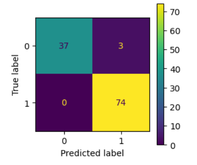

# [Machine Learning] 1st Proeject

    <b>MSc in Data Science</b>  
    NCSR Demokritos and University of Peloponnese  
    <b>Project for Machine Learning Course</b>  
    December 2023

 The first objective of this project was to explore and <b>analyze the Breast Cancer Dataset [^1] and develop a classification model</b> by applying data visualization, statistical summaries, and multiple machine learning algorithms to identify the most accurate model, evaluate its performance using metrics like accuracy and confusion matrix, and validate results through a proper training/test split or cross-validation. The second part of the project focused on performing a <b>regression analysis using the Diabetes Dataset [^2]</b>, involving a comprehensive examination of the data through statistical summaries, distribution and correlation plots, feature engineering techniques such as normalization and standardization, and the evaluation and tuning of multiple regression algorithms to identify and optimize the best-performing model. 

## 🧪 Results

### 🔍 Classification – Breast Cancer Dataset
1. **Best Model:** _Logistic Regression_  
2. **Accuracy:** _97%_  
3. **Precision score:** _0.96_    
4. **Recall score:** _1.00_  
5. **F1 score:** _0.98_  
6. **Validation Method:** _10-fold cross-validation_  
7. **Confusion Matrix:**

**Key Insights:**
- The model achieved a high **accuracy of 97%**, correctly predicting the vast majority of instances.
- **Precision score of 0.96** indicates strong performance in identifying positive cases, with very few false positives (3).
- A **perfect recall score of 1.00** means the model successfully identified all actual positive cases with no false negatives.
- **F1 score of 0.98** reflects a well-balanced model performance between precision and recall.

### 📈 Regression – Diabetes Dataset
1. **Best Model:** _e.g., Ridge Regression (with 0-1 normalization)_
2. **R² Score:** _e.g., 0.41_
3. **MSE (Mean Squared Error):** _e.g., 42.3_
4. **Feature Engineering Applied:**
   - Normalized features using 0–1 scaling to adjust for differing attribute ranges.
   - Removed highly correlated attributes ('sex', 's2') to reduce multicollinearity.  

**Key Insights:**
   - Achieved a **Mean Squared Error (MSE)** of **2913.67**, indicating the average squared difference between predicted and actual values.
   - Obtained a **Variance Score (R²)** of **0.41**, meaning the model explains 41% of the variability in the target variable.
   - Normalization helped improve model stability and performance compared to baseline results.

---

### 📌 Notes
- All models were built using **Scikit-learn**.
- Visualizations were created using **Matplotlib** and **Seaborn**.
- Full implementation details and plots are available in the [`notebooks/`](./notebooks/) folder.

---

[^1]: [Breast Cancer Database](https://archive.ics.uci.edu/dataset/17/breast+cancer+wisconsin+diagnostic)
[^2]: [Diabetes Database](https://www4.stat.ncsu.edu/~boos/var.select/diabetes.html)
